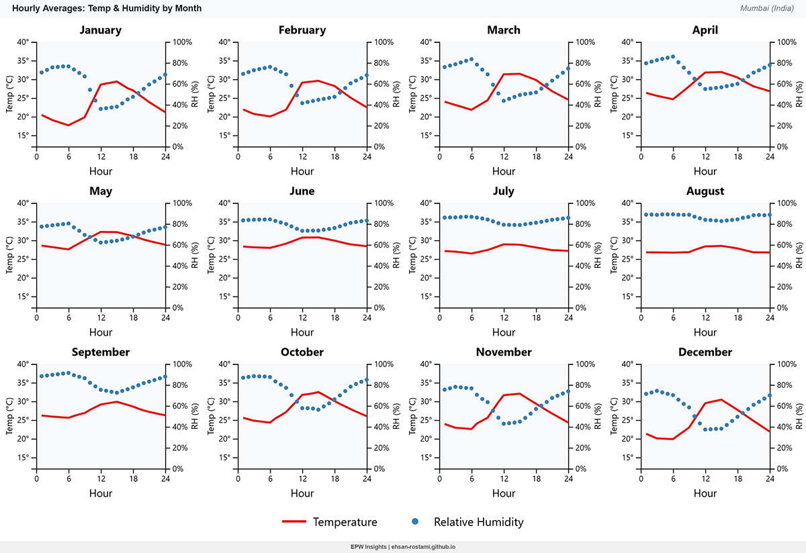
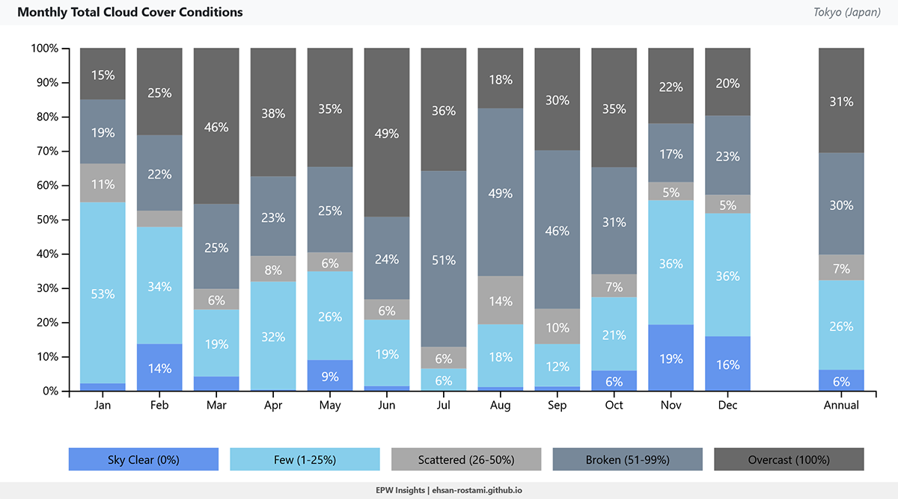
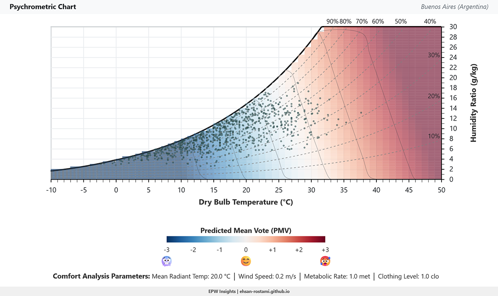
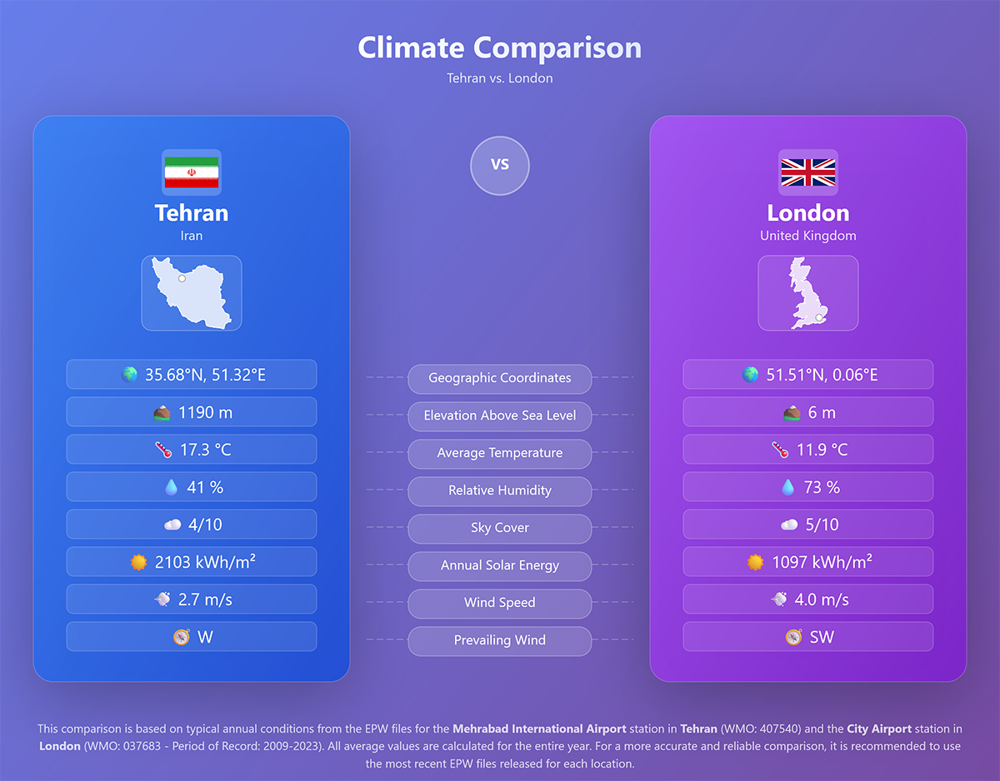
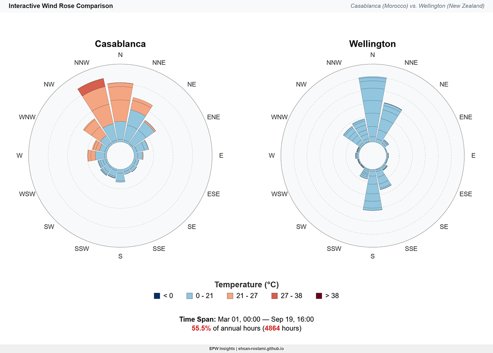
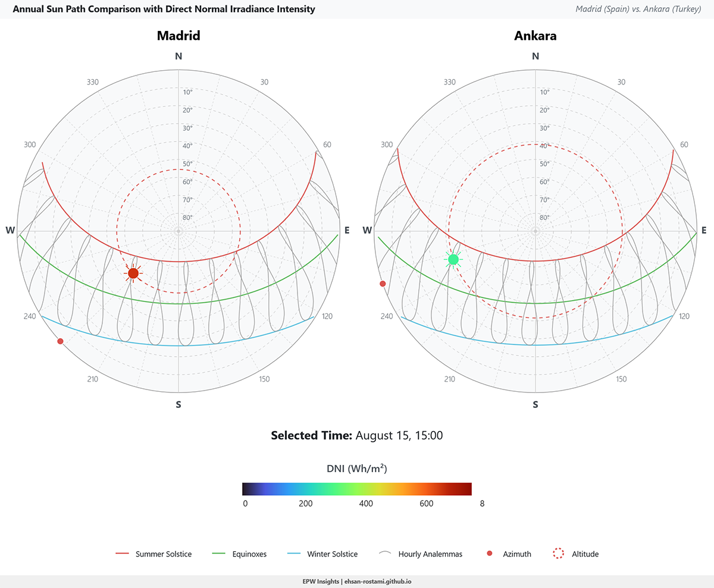

# 🌤️ EPW Insights
**Advanced Weather Data Visualization & Analysis**

[](https://opensource.org/licenses/MIT)
[](https://ehsan-rostami.github.io/epw-insights/)
[](https://d3js.org/)
[](https://getbootstrap.com/)

EPW Insights is a web-based tool designed for visualizing and analyzing EnergyPlus Weather (EPW) data. It provides interactive charts and tables to explore various climate parameters, offering a comprehensive understanding of weather patterns for a given location. The application also includes a comparison feature, allowing users to analyze two EPW files side-by-side.

## 🌐 Live Demo
Experience EPW Insights live at: https://ehsan-rostami.github.io/epw-insights/

## 📸 Screenshots
Click on any image to view full size
<table>
  <tr>
    <td align="center" width="33%">
      <a href="screenshots/humidity-chart.png" target="_blank">
        
      </a>
      <br/>
      <b>🌡️ Temperature & Humidity</b>
      <br/>
      <sub>Hourly averages by month</sub>
    </td>
    <td align="center" width="33%">
      <a href="screenshots/cloud-cover.png" target="_blank">
        
      </a>
      <br/>
      <b>☁️ Sky Cover Analysis</b>
      <br/>
      <sub>Monthly cloud conditions</sub>
    </td>
    <td align="center" width="33%">
      <a href="screenshots/psychrometric-chart.png" target="_blank">
        
      </a>
      <br/>
      <b>📈 Psychrometric Chart</b>
      <br/>
      <sub>Professional comfort analysis</sub>
    </td>
  </tr>
  <tr>
    <td align="center">
      <a href="screenshots/compare-overview.png" target="_blank">
        
      </a>
      <br/>
      <b>🔍 Climate Comparison</b>
      <br/>
      <sub>Side-by-side analysis</sub>
    </td>
    <td align="center">
      <a href="screenshots/compare-wind.png" target="_blank">
        
      </a>
      <br/>
      <b>💨 Wind Rose Comparison</b>
      <br/>
      <sub>Interactive wind patterns</sub>
    </td>
    <td align="center">
      <a href="screenshots/sun-path-comparison.png" target="_blank">
        
      </a>
      <br/>
      <b>🌅 Sun Path Analysis</b>
      <br/>
      <sub>Solar irradiance patterns</sub>
    </td>
  </tr>
</table>
</div>

## ✨ Features

### 🔧 Core Functionality
- 📄 **EPW File Parsing**: Robust parsing of standard EPW files to extract meteorological data and metadata
- 📍 **Location Summary**: Displays key geographic and climatic information for the loaded EPW file, including average temperature, humidity, solar energy, and wind speed
- 🗺️ **Interactive Map**: Visualizes the EPW file's location on an interactive map using Leaflet.js

### 📊 Comprehensive Visualizations

#### 🌡️ Air Temperature
- Annual heatmap
- Monthly distribution box plot
- Hourly diurnal averages for dry bulb and dew point temperatures

#### 💧 Relative Humidity
- Annual heatmap
- Monthly distribution box plot
- Hourly diurnal averages

#### ☁️ Sky Cover
- Monthly total cloud cover conditions
- Frequency of sky cover by month

#### 💨 Wind
- Interactive wind rose diagrams (dynamic and monthly)
- Average monthly wind speed bar chart

#### ☀️ Solar Radiation
- Annual Direct Normal Irradiance (DNI) heatmap
- Average monthly solar radiation (GHI, DNI, DHI) multi-bar chart
- Average daily sun hours bar chart

#### 🌅 Sun Path
- Annual sun path diagrams with irradiance intensity
- Interactive date/time selection
- Detailed solar position data
- Solar calculations powered by SunCalc.js

#### 📈 Psychrometric Chart
- Interactive psychrometric chart displaying:
  - Dry bulb temperature
  - Humidity ratio
  - Relative humidity
  - Wet bulb temperature
  - Enthalpy
  - Vapor pressure
- Comfort zone overlays (ASHRAE 55 and ISO 7730 PMV)

### 🛠️ Additional Features
- 📋 **Data Tables**: View monthly, daily, and hourly summaries of various weather parameters in tabular format
- ⚖️ **Comparison Mode**: Load two EPW files and compare key climate metrics side-by-side across various visualization categories (Overview, Air Temperature, Relative Humidity, Sky Cover, Wind, Solar Radiation, Sun Path)
- 🎨 **Customization**: Control chart appearance, color palettes, and displayed metrics through intuitive left-panel controls
- 📤 **Export Functionality**: Export charts as PNG images for reports or presentations
- 📱 **Responsive Design**: Optimized for various screen sizes, ensuring a consistent user experience on desktops and mobile devices
- ✏️ **Location Name Customization**: Override auto-parsed city and station names for cleaner chart titles and exports.

## 🛠️ Technologies Used

-  **HTML5**: Structure of the web application
-  **CSS3 (Bootstrap 5)**: Styling and responsive layout
-  **JavaScript (ES6+)**: Core application logic and interactivity
-  **D3.js (v7)**: Powerful library for data-driven document manipulation and complex chart rendering
- 🗺️ **Leaflet.js**: Interactive maps for displaying location data
- ☀️ **SunCalc.js**: Library for solar position calculations in the Sun Path chart

## 📁 Project Structure

```
.
├── css/
│   ├── compare-overview.css
│   └── style.css
├── epw/
│   ├── London.epw
│   └── Tehran.epw
├── img/
│   ├── camera-icon.png
│   ├── coordinates.png
│   ├── elevation.png
│   ├── humidity.png
│   ├── marker-icon.png
│   ├── radiation.png
│   ├── temperature.png
│   └── wind.png
├── js/
│   ├── air-temperature-charts.js
│   ├── app.js
│   ├── compare-air-temperature.js
│   ├── compare-charts.js
│   ├── compare-overview.js
│   ├── compare-relative-humidity.js
│   ├── compare-sky-cover.js
│   ├── compare-solar-radiation.js
│   ├── compare-sun-path.js
│   ├── compare-wind.js
│   ├── data-tables.js
│   ├── epw-parser.js
│   ├── location-formatter.js
│   ├── location-summary.js
│   ├── map-display.js
│   ├── psychrometric-chart.js
│   ├── relative-humidity-charts.js
│   ├── sky-cover-charts.js
│   ├── solar-radiation-charts.js
│   ├── sun-path-chart.js
│   ├── svg-exporter.js
│   └── wind-charts.js
├── screenshots/
│   ├── cloud-cover.png
│   ├── compare-overview.png
│   ├── compare-wind.png
│   ├── humidity-chart.png
│   ├── psychrometric-chart.png
│   └── sun-path-comparison.png
├── favicon.ico
├── index.html
├── LICENSE
└── README.md
```

## 🚀 Getting Started

To run this project locally:

1. **Clone the repository:**
   ```bash
   git clone https://github.com/ehsan-rostami/epw-insights.git
   ```

2. **Navigate to the project directory:**
   ```bash
   cd epw-insights
   ```

3. **Open index.html in your web browser:**
   
   You can simply double-click `index.html` to open it in your default browser, or use a local web server (e.g., Live Server VS Code extension) for better asset loading.

## 📖 Usage

### Load EPW File(s)
- **Primary EPW File**: Drag and drop an EPW file into the designated "Primary EPW File" drop zone, or click the zone to select a file.
- **Comparison EPW File (Optional)**: Check the "Compare with another file" toggle. Then, drag and drop a second EPW file into the "Comparison EPW File" drop zone, or click to select.
- **Load Example**: Alternatively, check "Load example (Tehran vs. London)" to pre-load sample data and enable the comparison feature.

### Customize Location Names
- After loading a file, a "Customize Names" button will appear in the "Welcome to EPW Insights!" panel.
- Click this button to open the location editor.
- You can enter custom names for the City and Station for one or both loaded files.
- The changes are applied instantly to all charts, summaries, and export filenames.

### Explore Visualizations
- Navigate through the tabs (e.g., "Air Temperature", "Wind", "Psychrometric Chart") to view different interactive charts and data tables.
- Use the controls in the left panel of each tab to customize the visualizations (e.g., color palettes, data filters, display options).

### Compare Data
- If two EPW files are loaded, click the "Compare" tab. This tab provides side-by-side comparisons of various climate parameters.

### Export Charts
- Click the camera icon located at the top-right corner of each chart to export it as a PNG image.

### Copy/Download Data Tables
- In the "Data Tables" tab, use the copy or download (CSV) buttons to extract the tabular data.

## 🤝 Contributing

Contributions are welcome! If you have suggestions for improvements, new features, or bug fixes, please open an issue or submit a pull request on the GitHub repository.

## 🙏 Acknowledgements

- **[D3.js](https://d3js.org/)**: For powerful data visualization capabilities
- **[Bootstrap](https://getbootstrap.com/)**: For responsive design and UI components
- **[Leaflet.js](https://leafletjs.com/)**: For interactive mapping
- **[SunCalc.js](https://github.com/mourner/suncalc)**: For accurate solar position calculations
- **[Ladybug Tools](https://www.ladybug.tools)**, **[Dr. Andrew Marsh's Psychrometric Chart](https://andrewmarsh.com/software/psychro-chart-web)**, **[UCLA Climate Consultant](https://www.sbse.org/resources/climate-consultant)**, and **[epwvis](https://github.com/mdahlhausen/epwvis)**: As inspirations for the psychrometric chart, heatmap charts, and the viewer concept

## 📄 License

This project is released under the MIT License.